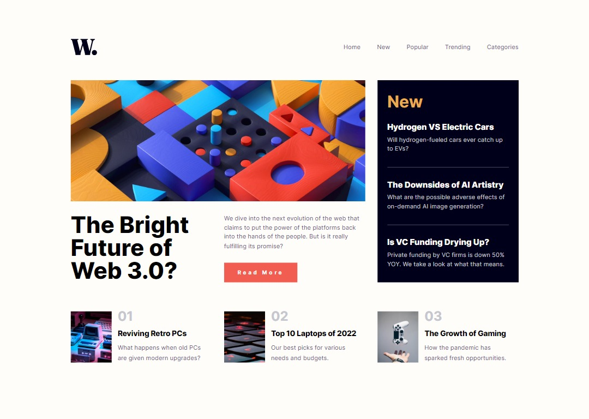

# Frontend Mentor - News homepage solution

A solution provided by jefflangtech [News homepage challenge on Frontend Mentor](https://www.frontendmentor.io/challenges/news-homepage-H6SWTa1MFl). 

## Table of contents

- [Overview](#overview)
  - [The challenge](#the-challenge)
  - [Screenshot](#screenshot)
  - [Links](#links)
- [My process](#my-process)
  - [Built with](#built-with)
  - [What I learned](#what-i-learned)
  - [Continued development](#continued-development)
  - [Useful resources](#useful-resources)
- [Author](#author)

## Overview

### The challenge

Users should be able to:

- View the page in desktop mode and mobile. It is not optimized for tablets or mediums-sized screens but will still work
- See hover and focus states for all interactive elements on the page
- Access a pretty standard nav-bar menu in desktop that moves to a slide-out drawer menu in mobile mode

### Screenshot

### Links

- Solution URL: [Frontend Mentor Solution](https://www.frontendmentor.io/solutions/news-webpage-implemented-with-css-gride-o5nWC7MW_O)
- Live Site URL: [JeffLangTech Github Repo](https://jefflangtech.github.io/news_homepage/)

## My process

### Built with

- Semantic HTML5 markup
- CSS custom properties
- Flexbox
- CSS Grid

### What I learned

This project was challenging in that, while it wasn't difficult to implement grid in the way I wanted for the desktop, transitioning some of the grid children through media query breakpoints down to mobile size didn't work as well as I'd have hoped. 

I think having a designed tablet view to work off of would have made a difference.

I did learn, however, that I've been trying to implement slide-out nav menus wrong. I was using absolute positioning and dealing with some layout quirks and behaviors on previous pages. After reviewing a Kevin Powell video I realized that I needed to use fixed positioning, and that helped quite a bit.

### Continued development

My next steps are going to be to focus on implementing page sections instead of entire pages. Definitely I will need more practice with grid across a wide variety of designs. I will probably begin with navbars first though.

### Useful resources

- [Kevin Powell: Responsive navbar tutorial using HTML CSS & JS](https://www.youtube.com/watch?v=HbBMp6yUXO0&t=2530s) - This was actually from a Frontend Mentor Challenge that Kevin Powell did, and I specifically was looking at the parts where he implemented the nav menu

## Author

- Website - [JeffLangTech](https://jefflangtech.github.io/)
- Frontend Mentor - [@jefflangtech](https://www.frontendmentor.io/profile/jefflangtech)
- Twitter - [@jefflangtech](https://www.twitter.com/jefflangtech)
